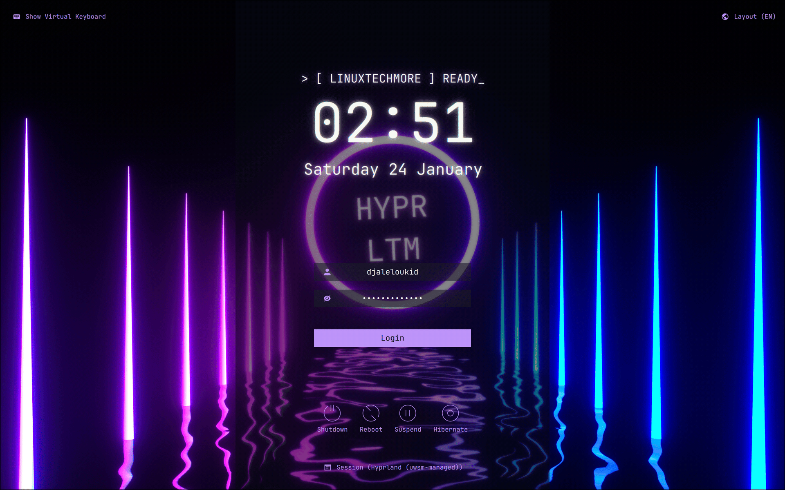
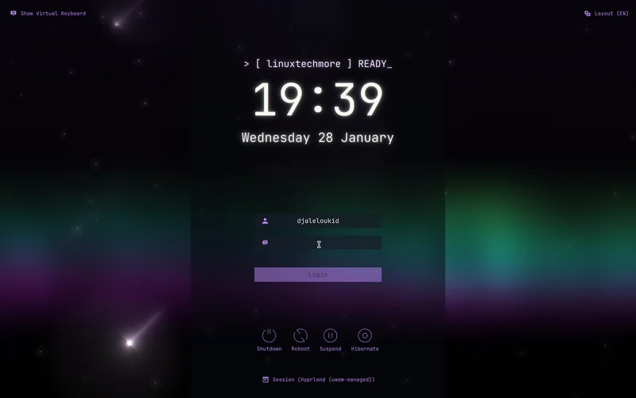

# ltmnight-sddm-theme

[](https://www.linuxtechmore.com/)


**Premium SDDM Theme with LTMNight Styling**

A modern, polished SDDM login theme featuring the LTMNight aesthetic — deep dark backgrounds, vibrant purple accents, and subtle glow effects. Works on any Linux distribution with SDDM (Arch, Fedora, Ubuntu, openSUSE, etc.).

## Previews

### Static


### Live Preview


### Animated Shader (GLSL)

> **Note**: Requires OpenGL 2.1+ support (GPUs from 2010+). For very old hardware, it is recommended to use **Static Image** mode.

## Features
*   **LTMNight Styling** — **Deep Dark** backgrounds, **Vibrant** accents, and **Fluid** interactions.
*   **Live Backgrounds** — Supports MP4, WebM, MKV, and animated GIFs.
*   **Partial Blur** — Frosted glass effect behind the login form.
*   **Dynamic Hostname** — Personalized header showing your machine's name.
*   **Virtual Keyboard** — Toggle in top-left corner, auto-show option for touch devices.
*   **Session Selector** — Dropdown centered at the bottom to choose your desktop environment.
*   **Keyboard Layout** — Globe icon in top-right corner to switch input languages.
*   **Multi-Language** — 15 languages with auto-detection, RTL support for Arabic/Persian/Urdu.
*   **HiDPI Ready** — Auto-scales UI based on screen resolution.

## Dependencies

| Package | Arch | Fedora | Debian/Ubuntu |
|---------|------|--------|---------------|
| SDDM (Qt6) | `sddm` | `sddm` | `sddm` |
| Qt6 Quick | `qt6-declarative` | `qt6-qtdeclarative` | `qml6-module-qtquick-*` |
| Qt6 SVG | `qt6-svg` | `qt6-qtsvg` | `libqt6svg6` |
| Qt6 Multimedia | `qt6-multimedia-ffmpeg` | `qt6-qtmultimedia` | `qml6-module-qtmultimedia` |

| Font | `ttf-jetbrains-mono` | `jetbrains-mono-fonts` | `fonts-jetbrains-mono` |
| Virtual Keyboard | `qt6-virtualkeyboard` | `qt6-qtvirtualkeyboard` | `qml6-module-qtquick-virtualkeyboard` |

## Installation

### One-Line Install (Recommended)
```bash
curl -sSL https://raw.githubusercontent.com/hyprltm/ltmnight-sddm-theme/main/setup.sh | sudo bash
```
> The installer is interactive and will ask for your preferences on:
> *   **Background Style** (Static Image, Live Video, or Animated LTMNight Shader)
> *   **Virtual Keyboard** (Disabled, Manual, or Touch Mode)

### Install via AUR (Arch & Manjaro)

```bash
yay -S ltmnight-sddm-theme
```
> [!NOTE]
> After installing, run `sudo ltmnight-sddm-configurator` to customize the background and Virtual Keyboard!

### Install via KDE System Settings
If you are using **KDE Plasma**, you can install the theme directly via **KDE System Settings**.

> [!NOTE]
> This requires the **SDDM KCM** module (usually installed as `sddm-kcm` or part of `plasma-desktop`).

1. Go to **System Settings** > **Login Screen (SDDM)**.
2. Click **"Get New SDDM Themes..."**.
3. Search for **"LTMNight SDDM Theme"**.
4. Click **Install**.

> [!TIP]
> To customize the theme (Background/Keyboard) after installing:
> ```bash
> sudo /usr/share/sddm/themes/ltmnight/setup.sh
> ```

### Manual
1.  Copy the following folders/files to `/usr/share/sddm/themes/ltmnight`:
    *   `Assets/`
    *   `Backgrounds/`
    *   `Components/`
    *   `Themes/`
    *   `i18n/`
    *   `Main.qml`
    *   `metadata.desktop`
2.  Edit `/etc/sddm.conf.d/theme.conf`:
    ```ini
    [Theme]
    Current=ltmnight
    ```

## Customization

Create a user config file (won't be overwritten on updates):
```
/usr/share/sddm/themes/ltmnight/Themes/hyprltm.conf.user
```

**Example:**
```ini
[General]
HideVirtualKeyboard="true"
Background="ltmnight"  # Use "ltmnight" for the shader, or path to image/video
```

### Available Options
All options are in the theme config. Key ones:

| Option | Description |
|--------|-------------|
| `Background` | `path/to/file` or `"ltmnight"` (Shader) |
| `PartialBlur` | `"true"` or `"false"` to enable blur behind login form |
| `FormPosition` | `left`, `center`, or `right` |
| `HourFormat` | Time format (e.g., `HH:mm`) |
| `HeaderText` | Custom header text |
| `HideVirtualKeyboard` | Set to `true` to hide on-screen keyboard |

### High DPI & Scaling
The theme automatically scales UI elements based on screen height.

**Note**: SDDM v0.20.0+ enables HiDPI support by default.
You only need to configure the following for custom **Fractional Scaling** (e.g., 125% or 150%):

Create `/etc/sddm.conf.d/hidpi.conf`:
```ini
[General]
GreeterEnvironment=QT_SCREEN_SCALE_FACTORS=2,QT_FONT_DPI=192
```

## Testing
Preview the theme without logging out:
```bash
sddm-greeter-qt6 --test-mode --theme $(pwd)
```

### Virtual Keyboard

**Three modes** (configured via install script):

| Mode | Use Case | Auto-Show | Toggle Button |
|------|----------|-----------|---------------|
| **Disabled** | Desktop with physical keyboard | No | Hidden |
| **Manual** | Security / broken keyboard | No | Visible |
| **Touch** | Tablet / touchscreen | Yes | Visible |

**Manual configuration** (if not using install script):

1. Create `/etc/sddm.conf.d/virtualkeyboard.conf`:
```ini
[General]
InputMethod=qtvirtualkeyboard
```

2. Create `hyprltm.conf.user` in theme folder:
```ini
[General]
HideVirtualKeyboard="false"
VirtualKeyboardAutoShow="false"   # or "true" for touch mode
```

> [!WARNING]
> Use the **theme's toggle button** to hide the keyboard. The keyboard's built-in hide button has a [known Qt6 bug](https://github.com/sddm/sddm/issues/2152) that causes crashes.

## ❤️ Support the Project

If you find this theme helpful, there are many ways to support the project:

### Financial Support
If you'd like to support the development financially:

<a href="https://www.buymeacoffee.com/linuxtechmore"></a>
<a href="https://github.com/sponsors/sniper1720"></a>

#### Bitcoin (BTC) Support


```text
1ALZQ6F2CkjQMP8rJrUnXgfVdWwbc6RPYu
```

### Contribute & Support
Financial contributions are not the only way to help! Here are other options:
- **Star the Repository**: It helps more people find the project!
- **Report Bugs**: Found an issue? Open a ticket on GitHub.
- **Suggest Features**: Have a cool idea? Let me know!
- **Share**: Tell your friends!

Every bit of support helps keep the project alive and ensures I can spend more time developing open source tools for the Linux community!

## License
**Copyright (C) 2026 Djalel Oukid (sniper1720)**
Licensed under the **GNU Affero General Public License v3.0 (AGPL-3.0)**.
Free to share and modify, but changes must be open-sourced.
